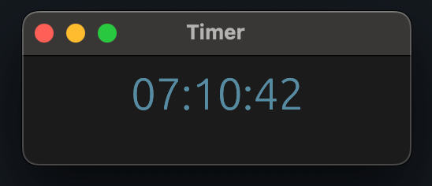

# Timer

一个基于 Rust 和 [egui](https://github.com/emilk/egui) 构建的桌面时间显示 GUI 程序。

## 功能特性

- **实时时间显示**：从互联网时间服务器获取并显示当前时间戳
- **财经事件提醒**：从 Finviz API 获取未来 5 天的财经事件，并在事件即将到来时显示倒计时
- **自定义主题**：支持浅色、深色和系统主题
- **窗口层级设置**：可设置普通、置顶或置底
- **样式自定义**：可调整时间戳和信息的颜色、字体大小
- **跨平台支持**：支持 Windows、macOS 和 Linux

## 界面预览



## 使用方法

### 启动程序

```bash
cargo run --release
```

### 打开设置

在时间戳上**右键点击**即可打开设置窗口。

### 配置说明

| 设置项 | 说明 |
|--------|------|
| Window Level | 设置窗口层级（普通、置顶、置底） |
| Timestamp Color | 时间戳文字颜色 |
| Timestamp Font Size | 时间戳文字大小 |
| Info Color | 财经事件信息文字颜色 |
| Info Font Size | 财经事件信息文字大小 |
| Theme | 主题模式（深色、浅色、跟随系统） |

## 配置文件

程序启动时会读取 `settings.toml` 文件中的配置，退出时会自动保存当前配置。

默认配置定义在 `default.toml` 文件中。

## 构建

```bash
# Debug 构建
cargo build

# Release 构建（推荐用于生产环境）
cargo build --release
```

## 技术栈

- **语言**：Rust
- **GUI 框架**：egui (eframe)
- **异步运行时**：tokio
- **HTTP 客户端**：reqwest
- **日志记录**：tracing

## 许可证

MIT License
